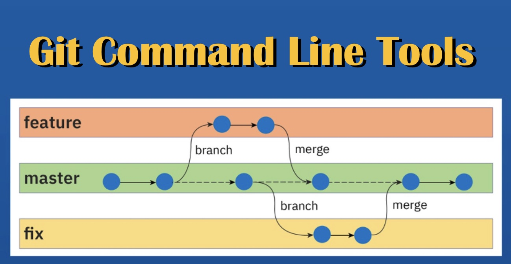

--------------------------------------------------------------------------------

# Git Command Line Tools

```sh
  chk           # checkout git branch
  gib           # create branch and bring changes
  gic           # git stage & commit
  gid           # delete a git branch
  gih           # echo git home directory
  gil           # log git history tree
  gip           # git push
  gir           # rename a git branch
  gis           # git status
  giu           # update git submodules
  prq           # create pull request
  tag           # create a git tag
```

## Checkout Git Branch

```sh
  usage: chk <branch> # git checkout branch & update submodules
         chk ihux     # git checkout ihux branch
         chk          # git checkout ihux branch (short hand)
         chk -a       # git checkout alfa-a1.0.1 & pull
         chk -b       # git checkout beta-b1.0.1 & pull
         chk -d       # git checkout develop & pull
         chk -r       # git checkout beta-b1.0.1 & pull
         chk -s       # git checkout staging & pull
         chk -c       # git checkout chintan & pull
         chk -i       # git checkout ihux & pull
         chk -m       # git checkout master & pull
         chk -u       # update & checkout ihux to match staging
         chk --version  # print version

   ALPHA:   alfa-a1.0.1
   BETA:    beta-b1.0.1
   RELEASE: beta-b1.0.1

  see also: chk, gic, gid, gih, gil, gip, gir, gis, giu, prq, tag
```

## Create Branch and Bring Changes

```sh
  usage: chk <branch> # git checkout branch & update submodules
         chk ihux     # git checkout ihux branch
         chk          # git checkout ihux branch (short hand)
         chk -a       # git checkout alfa-a1.0.1 & pull
         chk -b       # git checkout beta-b1.0.1 & pull
         chk -d       # git checkout develop & pull
         chk -r       # git checkout beta-b1.0.1 & pull
         chk -s       # git checkout staging & pull
         chk -c       # git checkout chintan & pull
         chk -i       # git checkout ihux & pull
         chk -m       # git checkout master & pull
         chk -u       # update & checkout ihux to match staging
         chk --version  # print version

   ALPHA:   alfa-a1.0.1
   BETA:    beta-b1.0.1
   RELEASE: beta-b1.0.1

  see also: chk, gic, gid, gih, gil, gip, gir, gis, giu, prq, tag
```

## Git Stage and Commit

```sh
   usage: gic 'message'   # git commit (after git add all)
          gic --version   # print version
   see also: chk, gic, gid, gih, gil, gip, gir, gis, giu, prq, tag
```

## Delete a Git Branch

```sh
   usage: gid -! <branch>      # git delete branch (local & remote)
          gid -! Bluco-V10.00
          gid --version   # print version
   see also: chk, gib, gic, gid, gih, gil, gip, gir, gis, giu, prq, tag
```

## Echo Git Home Directory

```sh
  usage: gih  # echo git home directory of git repository
         gih -?          # show usage
         gih --version   # print version
  see also: chk, gic, gid, gih, gil, gip, gir, gis, giu, prq, tag
```

## Log Git Tree

```sh
   usage: gil             # git log with decorated log tree
          gil <dir>       # git log from a given directory
          gil --version   # print version
   see also: chk, gic, gid, gih, gil, gip, gir, gis, giu, prq, tag
```

## Git Push

```sh
   usage: gip            # git push origin
          gip -o         # create branch at origin
          gip --version  # print version
   see also: chk, gib, gic, gid, gih, gil, gip, gir, gis, giu, prq, tag
```

## Rename a Git Branch

```sh
   usage: gir <old> <new>     # git rename branch (local & upstream)
          gir Bluco-V10.00 Bluco-V10.00.0
          gir -l <old> <new>  # git rename local branch
          gir -u <old> <new>  # git rename upstream branch
          gic -?              # show usage
          gic --help          # comprehensive help
          gic --version   # print version
   see also: chk, gic, gid, gil, gip, gir, gis, giu, prq, tag
```

## Git Status

```sh
   usage: gis            # git status (after git fetch)
          gis -s         # show some details
          gis --version  # print version
   see also: chk, gic, gid, gih, gil, gip, gir, gis, giu, prq, tag
```

## Update Git Submodules

```sh
   usage: giu    # git update all submodules recursively
          giu --version  # print version
   see also: chk, gic, gid, gih, gil, gip, gir, gis, giu, prq, tag
```


## Create Pull Request

```sh
   usage: prq             # pull request (open web page to perform)
          prq --version   # print version
   see also: chk, gic, gid, gih, gil, gip, gir, gis, giu, prq, tag
```


## Create a Git Tag

```sh
   usage: tag -! <tag>    # provide a tag (local & remote)
          tag -d <tag>    # delete a tag (local & remote)
          tag -r <tag>    # refresh a tag (local & remote)
          tag -?          # usage
          prq --version   # print version
   see also: chk, gic, gid, gih, gil, gip, gir, gis, giu, prq, tag
```
